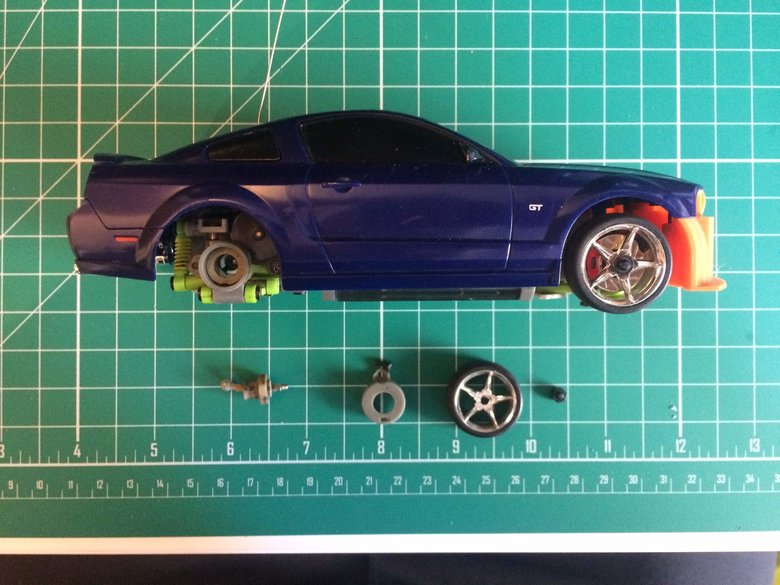
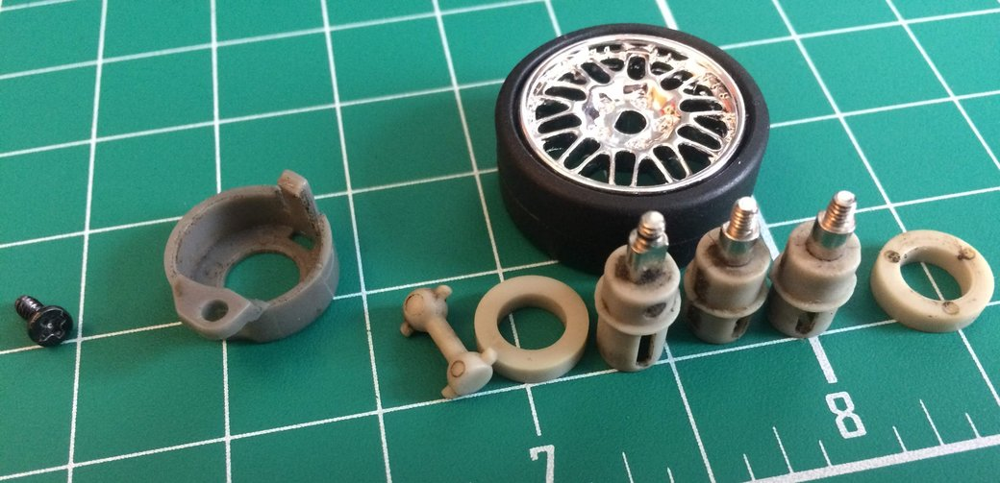
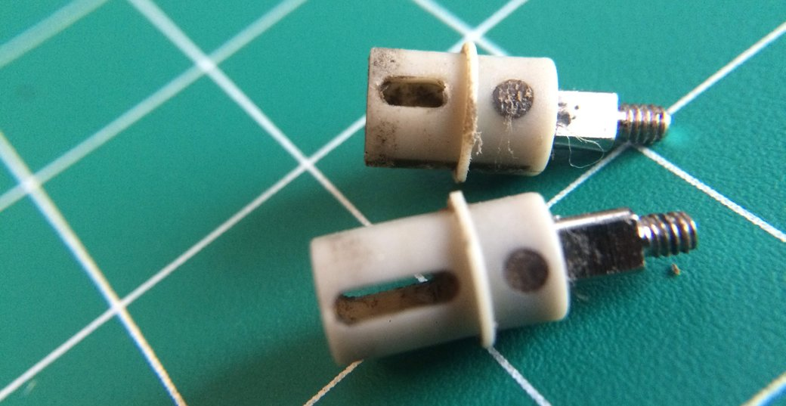
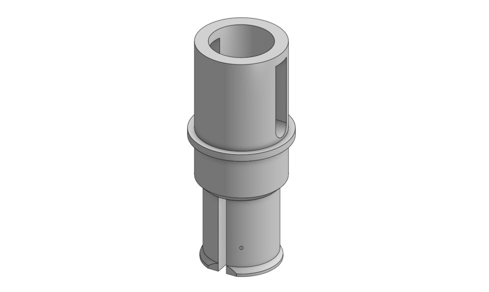
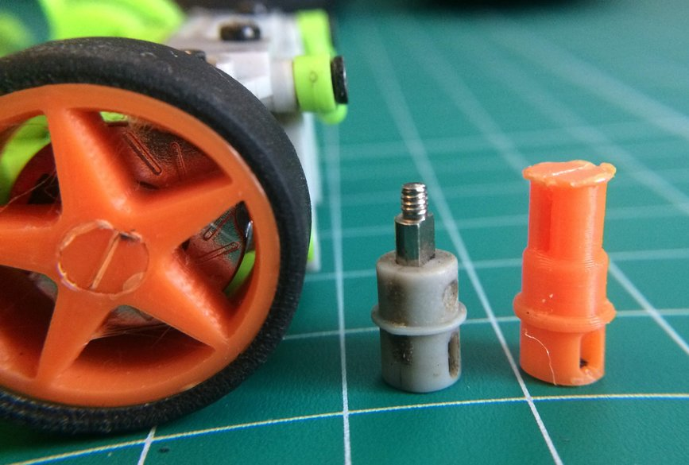
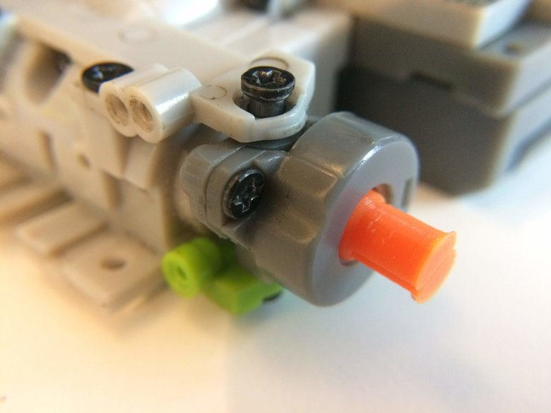
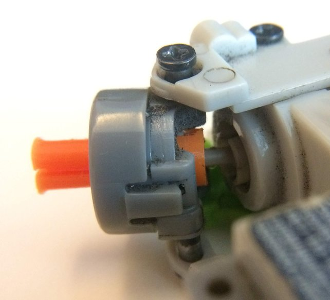
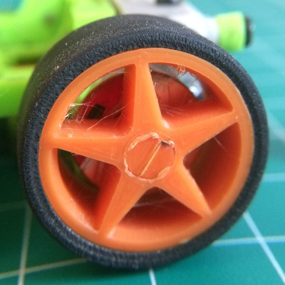
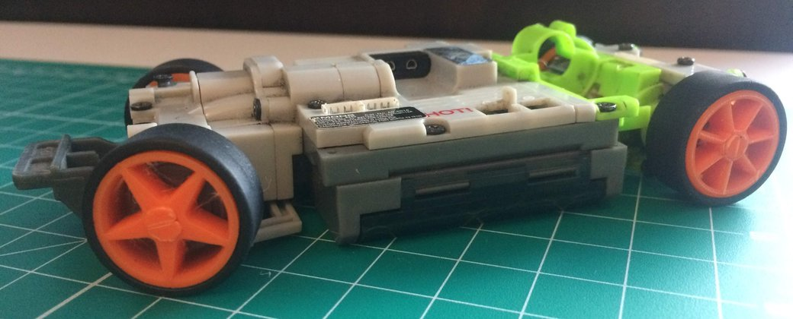
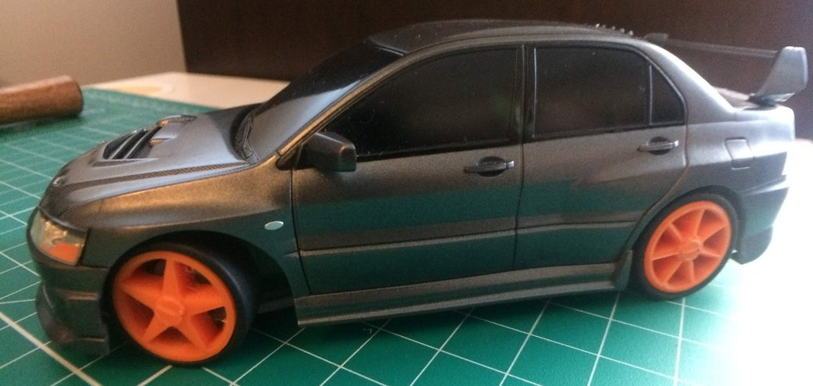

Today's focus was on replacing the wheels for the XMod. This has two purposes:
I've wanted to play around with printing my own wheel designs and I wanted to
experiment with replacing the wheel axles to see if I could reduce slop in the
wheels that comes from a loose fit between the axles and the hub.

One discrepancy I didn't notice when I was originally designing the replacement
axles was the difference between the front and rear hubs. The front hubs are
longer to allow for the swing in position as the front wheels steer, especially
with the wider steering racks.

# New Axles

The axles do scale fairly well. The longer axle is only different in the top
half by a couple millimeters. Otherwise the same design works for both front and
rear axles. Compared with the original parts, the printed axles are 0.4 mm
larger in diameter where it mates with the bushings. This makes for a
significantly tighter fit with less slop.

# New Wheels

The wheel designs have so far been simpler because they were printed with the
outer face of the wheel as the surface that supports the rest of the print.

