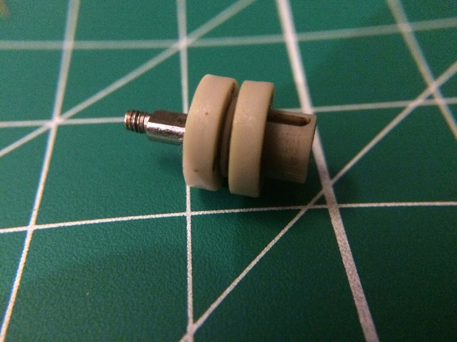
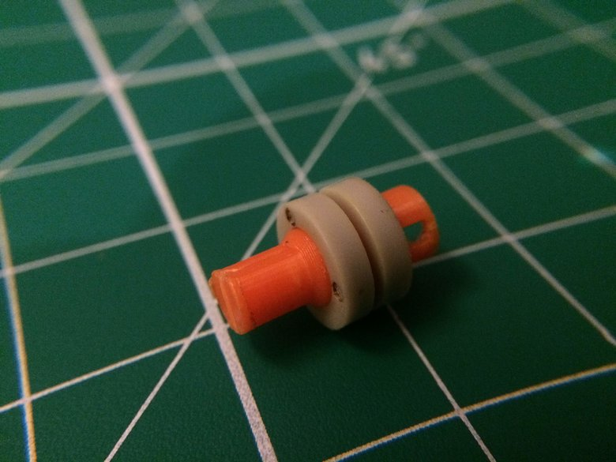
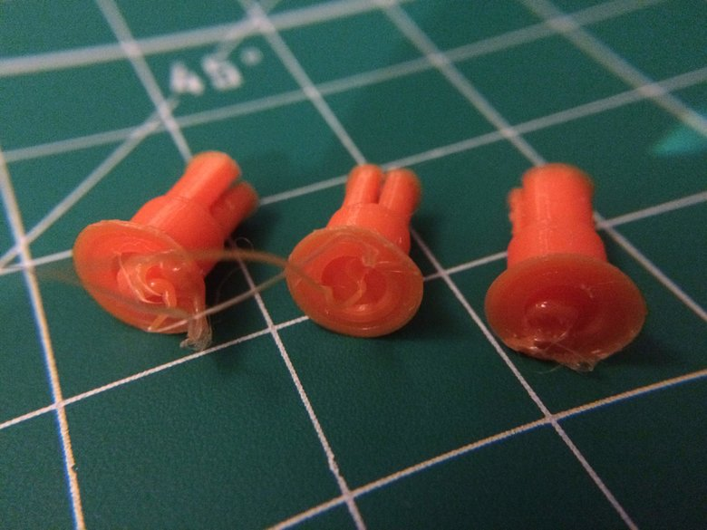
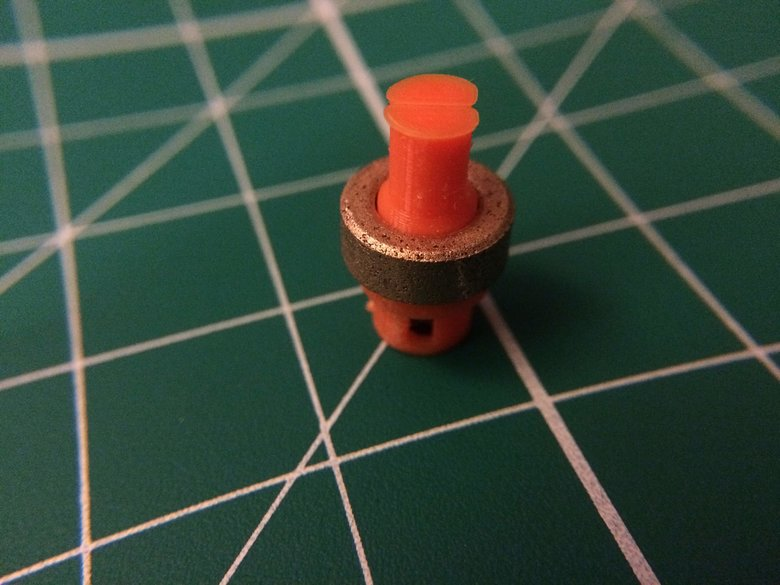
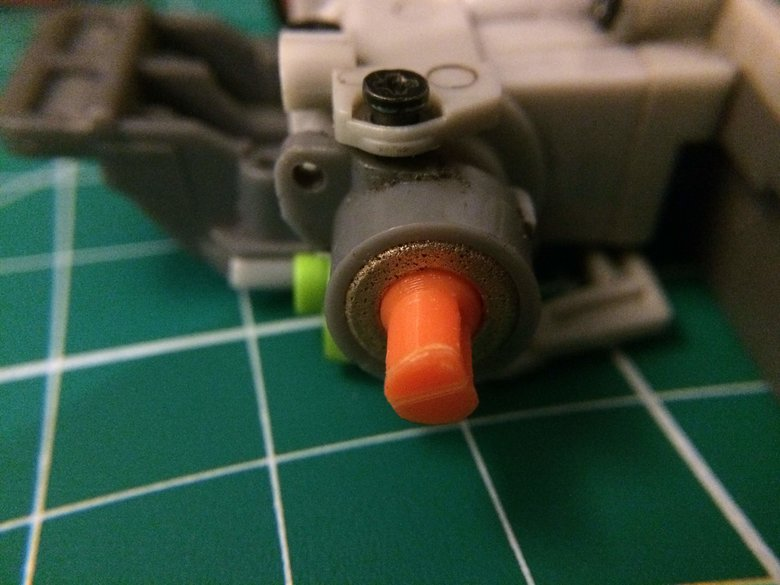
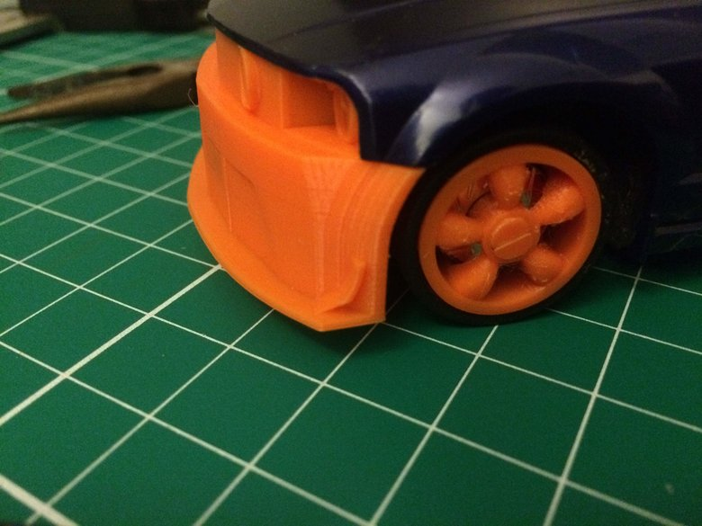

Pictures from Day 11

The axle design up for replacement

The initial axle design uses the plastic bushings that came with the car.

Some failed prints to investigate. Most of these came at the layer above the
flat surface on the axle where the diameter decreased.

Standalone axle and sleeve bearing

The fit for the metal sleeve bearings

Custom Bullitt-style wheels mounted using the same axle system on the '05 Mustang

