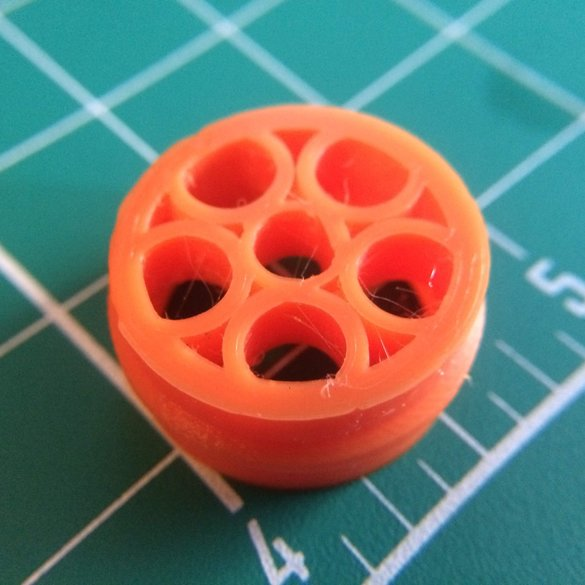
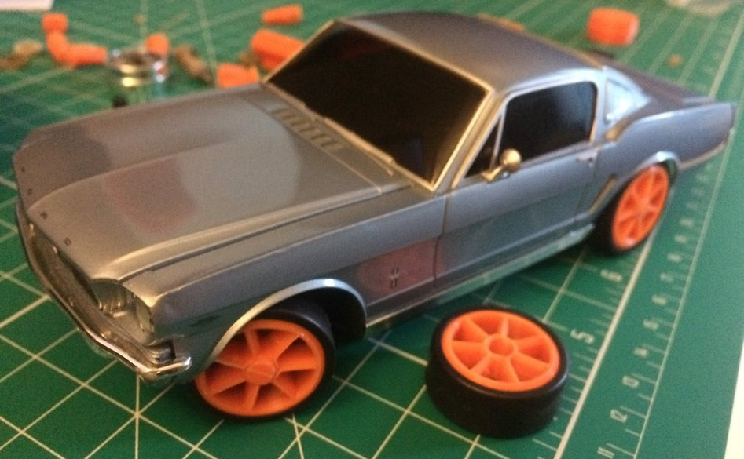

Pictures from Day 12

New wheel design! Inspired by the Alfa Romeo 8C

This second picture is a bit of a spoiler for an upcoming project: I'm hoping to
design new adapters for the new chassis design to fit the old style '65 Mustang
body built for the original XMods Chassis.

