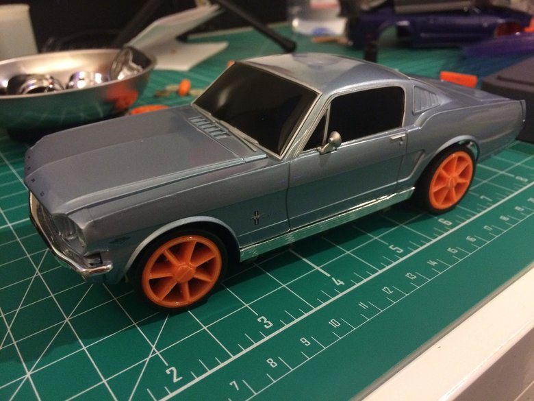

Old Body Style, Next Generation Power and Suspension

I also got around to replacing the springs for the shorter old chassis (formerly
the Evo, now the Evo and '65 Mustang).

I accidentally broke one of the half-shafts for the rear drive on the '05
Mustang chassis while trying to replace one of the axles. I ended up figuring
out a new design for the tiny part so I could 3D print it. Here in the middle is
the new half-shaft design, with other small parts for scale (and the scale of
the mat for scale). Each grid square is half-inch, the bottom units are
centimeters.

