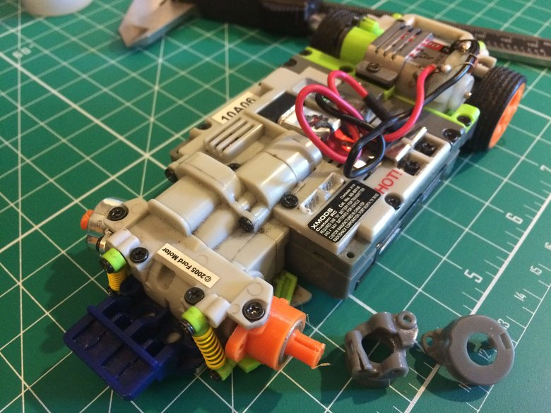
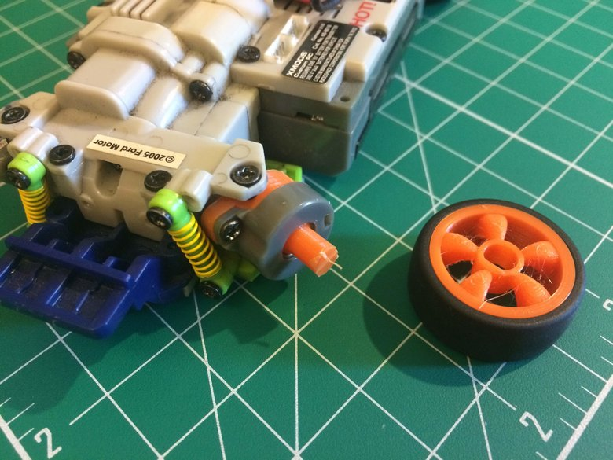
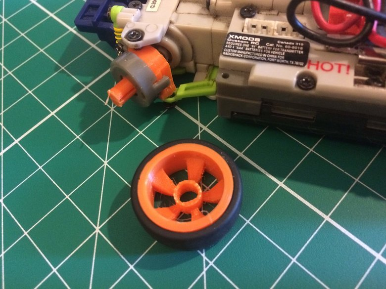
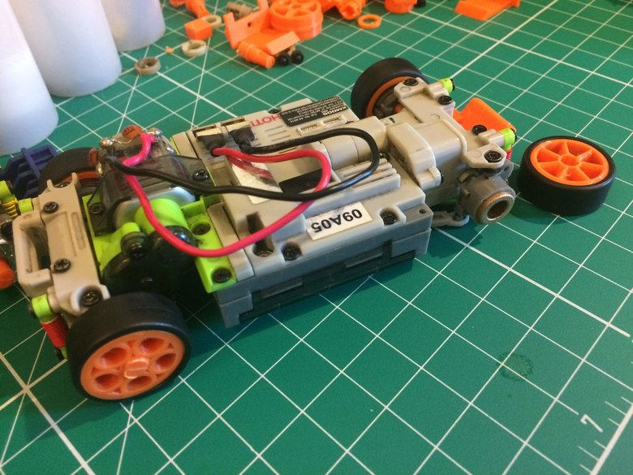
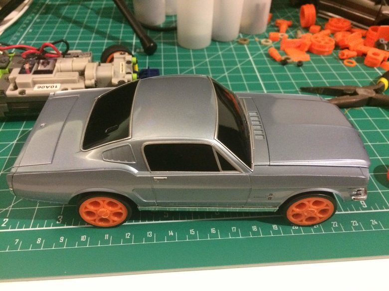
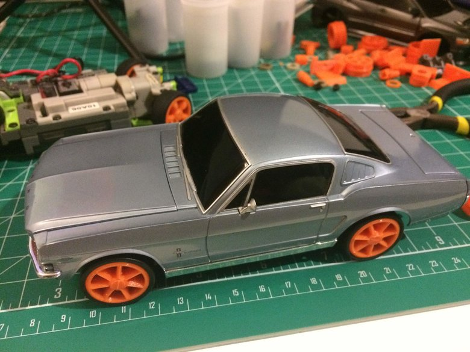

Photos from day 15

While re-assembling the front wheel setup for the '05 Mustang chassis, I cracked the front left suspension upright. After a handful of print iterations, I've gotten to something workable.

In better news, I was able to finish printing the new axle design, which means that I have a rolling chassis again for the Evo / '65 chassis. The first picture shows the chassis waiting for the last print for the front right axle.

