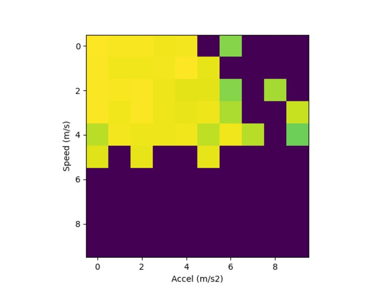

I've been tracking my training and ultimate frisbee games for some time now,
and I recently decided to turn the tracked data into metrics to quantify my running performance.

The initial motivation stems from watching a lot (a lot!) more Premier League
soccer and starting to learn more about how high level soccer teams track their
players to quantify performance. Some metrics are out of my league 
(e.g. [expected goals/xG](https://footystats.org/england/premier-league/xg),
but some are much more attainable. For example, the product 
["CatapultOne"](https://www.youtube.com/@catapultone206/videos) advertises
metrics such as:

- Total Distance covered
- Sprint Distance
- Power
- Top Speed

I figured I could take some of these metrics ideas and build on them to create
my own sports metrics.

# A Step in A Direction

I had initially jumped into the deep end of the complexity pool. My first
effort focused on trying to build a mapping from speeds and accelerations to
heart rate.

The mapping approach has promise because it would allow for comparing heart
rate in the same game situations by comparing the same location on the map and
the maps (2D histograms) lend themselves to easily visualization.

Here's one example, showing lower heart rates in yellow and higher heart rates
in green. Missing data is shown in purple. Within the visualization, one could
wave at a trend where higher acceleration correlates to higher hear rate;
however, the relationship isn't clear (and looking again I think I may have not
made the bins intuitive sizes).

After a few experiments, I found that I couldn't capture the relationship in
the histogram's 2-dimensional model because heart rate has a longer "history"
than just the current motion.

I haven't found a data to support a specific model yet, but my working mental
model is that heart rate is a moving window filter over the speed and changes
in direction in the last few seconds to last few minutes. The intuition is
pretty simple. If you're running faster, your heart rate should be higher. If
you've had to change direction more, your heart rate should be higher. If
you've run more in the last time window than been stopped, your heart rate
should be higher.

To take steps to find this relationship in the data, I recast the data as a
sequence of time windows of speed and acceleration, then used a linear model to
attempt to estimate heart rate. Putting it into scikit-learn terminology, X is
velocity and acceleration from a time window, y is heart rate. Call
scikit-learn fit methods and,
[bosh](https://www.youtube.com/watch?v=dzgWSEj8h58&t=810s), profit.

This was promising for many cases, but consistently fell down at the
tails of the distribution. My hypothesis is/was that the data over-samples from
low heart rate cases and low speed cases because a frisbee game is not a long
continuous run, but instead lots of standing around split up by bursts of point
to play and bursts of motion within the point.

- Aside: As I'm writing this, I think I can take an approach to weight points by an inverse of the density of nearby samples (or proportional to the distance to nearby samples) to achieve a rebalanced approach that's roughly uniform across heart rates.

Ultimately, this was a step in a promising direction, but it was a step in a
complicated direction and I lost momentum on implementing this approach and
other metrics to go with it.

# A New Direction, A Smaller Step

To get back on track, I've taken steps to build from simpler, composable
building blocks.

I've also recently built in some functionality to automatically produce some
more images to show results along the way. For example, when looking at a
histogram of speeds from a game there is an obvious bimodal pattern with a
strong peak at zero speed, then a distribution of speeds for in motion.

I also wanted to track how much distance I cover as a measure of work rate.
This is interesting within a game (I expect to see decreasing peak work rate
over a game) as well as across games. Some games may have less intensity, some
more, but I'd like to see an increase in peak work rate over time.

In follow on posts, I'd like to share what I've built on top of these initial
metrics and visualizations
